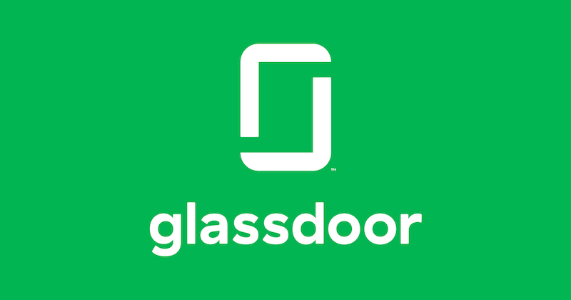
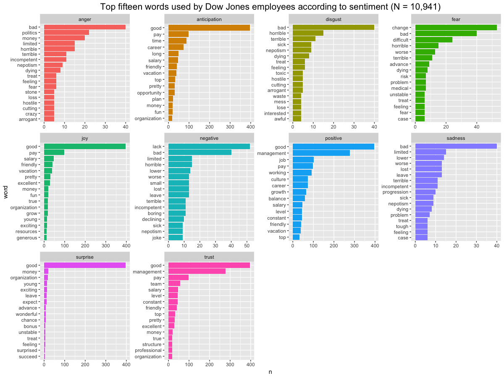
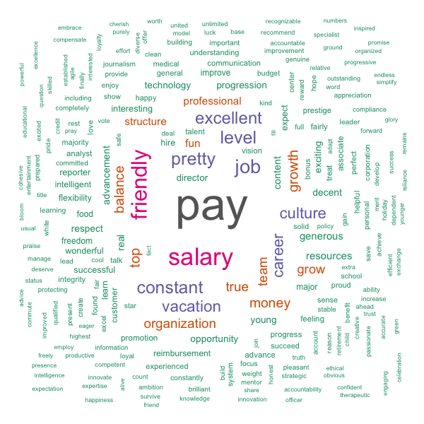
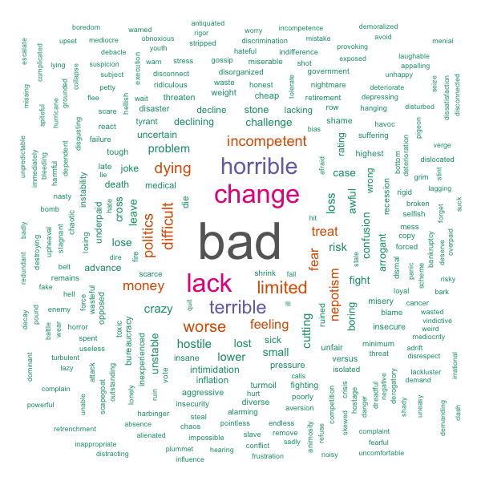
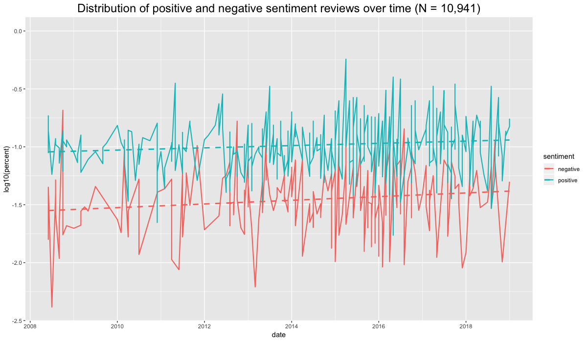
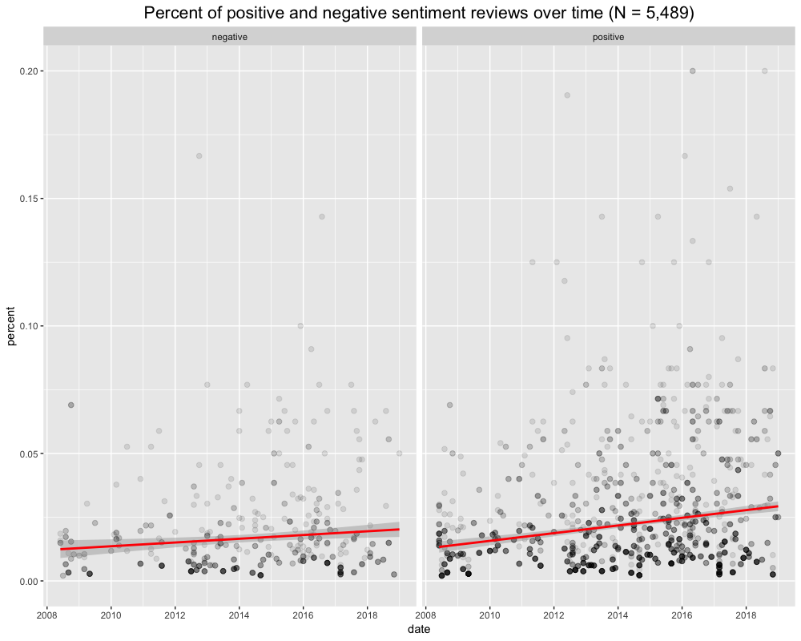

# Sentiment Analysis on Dow Jones Employee Reviews

#### A Date Science Project (still working on this. Stay tuned for more!)

  | 

 
___
## Overview
The goal of this project is to analyze topics in Glassdoor's employee reviews to understand what employees like and dislike about their employers. To answer this question, I conduct the following steps:
- Collect employee review data for Dow Jones between May 2008 and January 2019.
- Analyze a corpus of employee feedback using Natural Language Processing techniques. Identify latent topics and their relative importance.

***To go straight to results, [Click here!](#results)***

## Gathering Data

___
## Creating a Corpus

#### Web Scraping

#### Preparing the data: Using TidyText
In any Natural Language Processing analysis, cleaning up the raw data is essential to glean any meaning from the text. Without preprocessing the text, much of our analysis would be centered around different forms of the same word as well as articles and conjunctions. To get the text into its purest form for analysis, I took several steps.

##### *Stop Words*
The first step in cleaning up the corpus is removing [stop words](https://en.wikipedia.org/wiki/Stop_words). In a nutshell, stop words are common words that help to create sentence structure, but do not add any meaning to the idea that a sentence is trying to convey. For example, stop words in the sentence preceding this one would be:

- Stop words: *In, a, are, that, to, but, do, any, to, the, that, a, is, to*
- Meaningful words: *nutshell, stop, words, common, words, help, create, sentence, structure, not, add, meaning, idea, sentence, trying, convey*

You may notice that a few words are repeated in the above summary. This is important for our TF-IDF matrix (discussed later) which will help us to cluster different topics and the most frequent words within each topic.

##### *Stemming/Lemmatization*
After removing stop words from the corpus, the next step is [stemming](https://en.wikipedia.org/wiki/Stemming) or [lemmatizing](https://en.wikipedia.org/wiki/Lemmatisation) the text. Stemming involves removing endings from words to reduce each word to its stem (i.e. "working" is reduced to "work"). Lemmatization goes a step further, and reduces each word to its morphological root, or `lemma`, taking tense and other linguistic nuance into account (i.e. "is", "am", "are" become "be"). Lemmatization can be computationally more expensive, but it typically yields better results. I implemented a lemmatization algorithm using [spaCy](https://spacy.io) for this project.

##### *Part of Speech Tagging*
Part of speech tagging is another important step in Natural Language Processing. It allows for the inclusion or exclusion of certain parts of speech (e.g. articles, conjunctions) if they are not excluded in the removal of stop words. Part of speech tagging also helps in lemmatizing the corpus. Many words can be more than one part of speech. For example, take the word `work`. As a noun, "I have work to do." As a verb, "I work for Galvanize."

##### *N-grams*
One last step in successfully capturing ideas from the corpus of text is allowing for [n-grams](https://en.wikipedia.org/wiki/N-gram). N-grams are essentially sequential groups of words that communicate a different idea together than they do apart. A good example of an n-gram is `New England Patriots`. Together, the three words clearly allude to the NFL team. Apart, the words `New`, `England`, and `Patriots` communicate their own distinct ideas. In the context of this project, I did not discover any n-grams that were prevalent across the corpus.

___
## Methods
Ready to start looking at the results.

## Results

## Topics in Both Positive & Negative Feedback:

  

  

  

  

  

___
## Conclusion
The biggest overall challenge in this project. 

## Technologies Used

I used the following list of python packages, along with several other built-in libraries, in this Natural Language Processing project.
- [TidyText](https://www.tidytextmining.com)
- [ggplot visualization](https://ggplot2.tidyverse.org)
- [Word Cloud](https://cran.r-project.org/web/packages/wordcloud/wordcloud.pdf)

